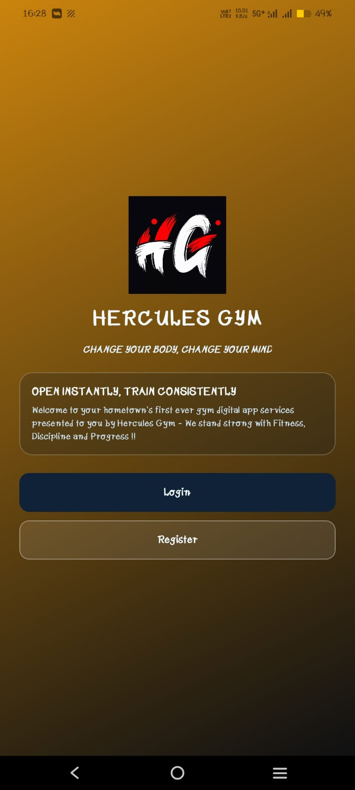
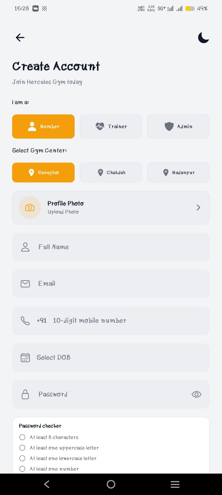
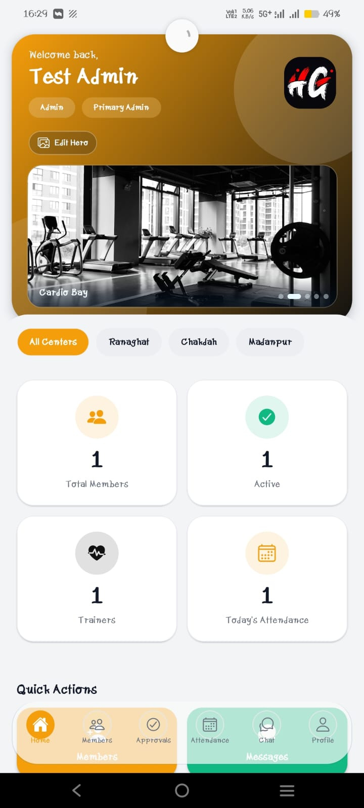
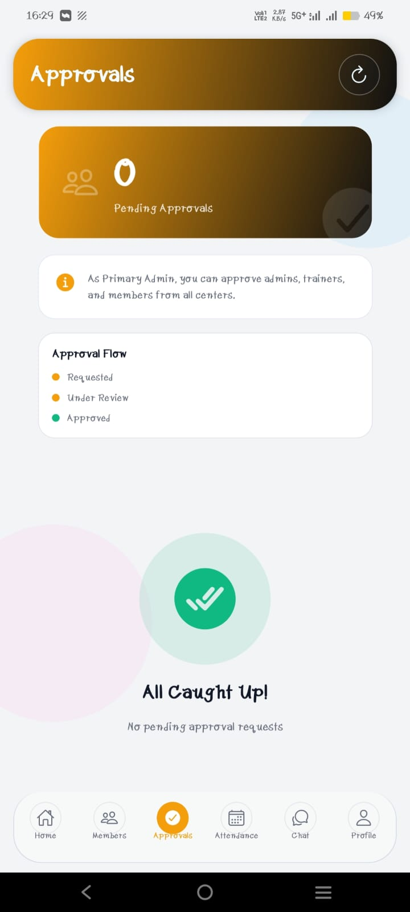
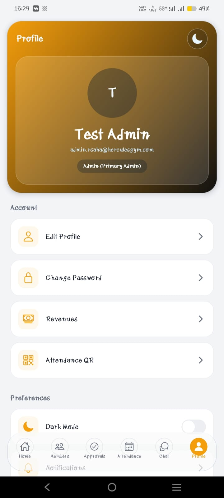
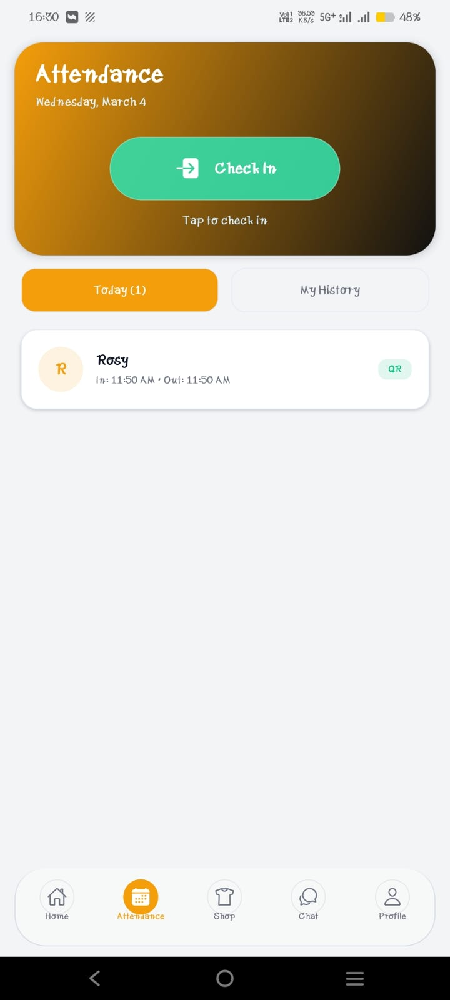
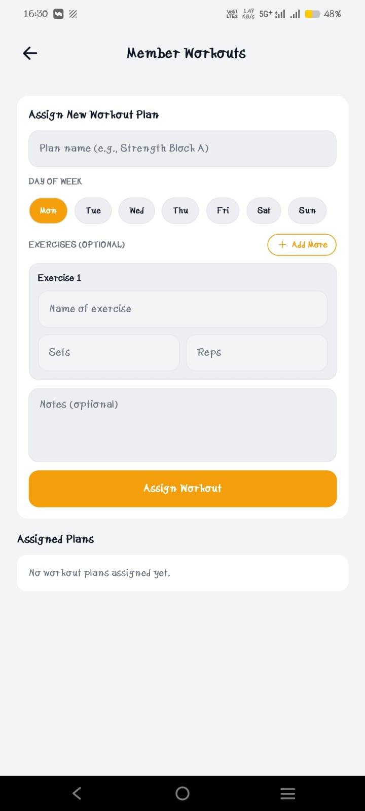
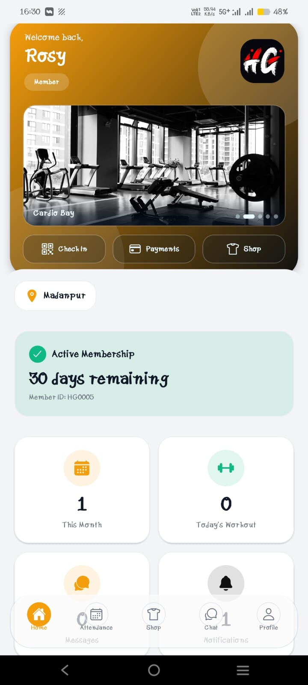
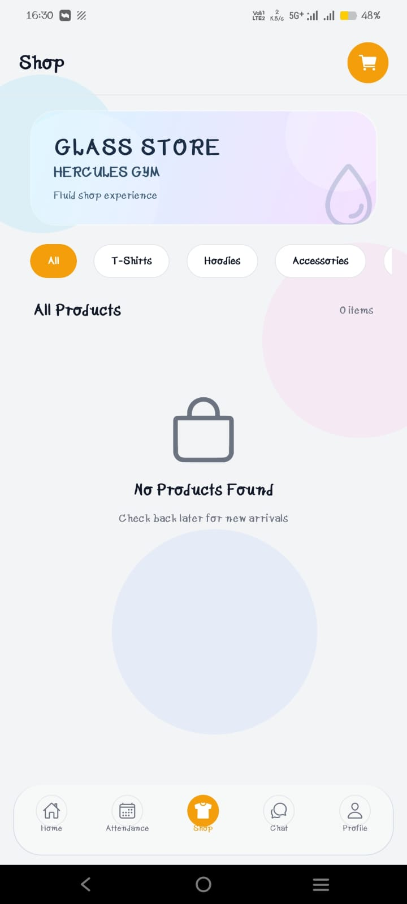

# Hercules Gym App

A client-driven digital gym operations platform built for **Hercules Gym** to replace fragmented manual processes with a centralized, role-based, and branch-aware system.

This app was built on direct request from the gym owner and stakeholders to digitize day-to-day operations across members, trainers, and admins.

## Why This Was Built

Hercules Gym needed a single system to manage:

- member lifecycle and approvals
- attendance and check-in consistency
- workouts, diet plans, and trainer assignments
- membership and shop payment records
- branch-wise communication and announcements
- profile data, reminders, and operational reporting

The goal was clear: **centralized data, faster decisions, fewer manual errors, and better accountability**.

## Stakeholder Demands (Client Requirements)

The client requested:

- a mobile-first app for admins, trainers, and members
- branch-wise controls (Ranaghat, Chakdah, Madanpur)
- centralized storage for all operational data
- payment reminder workflows and payment proof verification
- attendance visibility and role-restricted history
- bilingual experience (English and Bengali)
- low-friction UX with modern, dynamic UI
- production readiness for APK distribution and Play Store onboarding

## Core Salient Features

- role-based authentication and approval workflow
- member, trainer, and admin account registration with DOB and profile photo
- QR-based attendance flow with synchronized check-in/check-out logic
- attendance history controls (role and time-window scoped)
- monthly gym payment reminder system and late fee rules
- payment proof upload and admin-side verification workflow
- separate payment histories for membership and shop
- admin revenue section (history + totals)
- shop module with item-level purchase/payment flow
- branch-targeted announcements
- achievement management (admin-controlled) with announcement visibility windows
- birthday notifications (member, admin, branch trainer)
- change password + phone OTP based forgot-password flow
- bilingual content support (including proper Bengali script handling)

## Design Architecture and UX Tactics Used

- **Role-Oriented Information Architecture**: flows and screens split by operational responsibility (`member`, `trainer`, `admin`, `primary admin`).
- **Branch-Aware Domain Modeling**: data access and approvals scoped by center to prevent cross-branch data leakage.
- **API-First Backend Design**: FastAPI + Pydantic contracts used as the source of truth for mobile integration.
- **Operational Resilience**: retry wrappers for transient DB failures and background jobs for reminders/maintenance.
- **State Clarity in UX**: explicit status surfaces for approvals, payments, membership cycle, and attendance events.
- **Progressive Access UX**: quick landing entry and streamlined auth actions under poor network conditions.
- **Dynamic Visual Language**: card-based dashboarding, visual status markers, and feature-focused navigation density.

## Client Impact

Expected and observed operational impact:

- reduced dependency on paper/manual registers
- faster onboarding and approval turnaround
- clearer payment audit trail and verification accountability
- better trainer-member coordination through structured workout/diet assignment
- improved daily visibility through live dashboards and role-centric summaries
- stronger communication governance via announcement targeting

## Screenshots

These are real app screens captured from the current build.

| | | |
|---|---|---|
|  |  |  |
|  |  |  |
|  |  |  |

## Technology Stack

### Frontend

- Expo / React Native
- Expo Router
- TypeScript
- React Query + Zustand

### Backend

- FastAPI
- Python 3.11
- MongoDB (Motor/PyMongo)
- Socket.IO

### DevOps / Release

- Render (backend hosting)
- EAS Build (APK/AAB pipeline)
- Google Play Console (testing and rollout)
- GitHub Actions (CI workflow setup)

## Repository Structure

```text
.
|-- backend/            # FastAPI backend
|-- frontend/           # Expo React Native app
|-- docs/screenshots/   # README screenshots
|-- scripts/            # automation and smoke tests
|-- reports/            # build/test/release artifacts
`-- .github/workflows/  # CI/CD workflows
```

## Local Development

### Backend

```bash
cd backend
python -m venv .venv
.venv\Scripts\activate
pip install -r requirements.txt
uvicorn server:app --reload --host 0.0.0.0 --port 8000
```

### Frontend

```bash
cd frontend
npm install
npm run start
```

Set backend URL via `EXPO_PUBLIC_BACKEND_URL` for release environments.

## Testing and Quality

- API smoke and regression checks under `scripts/`
- backend compile check (`python -m py_compile backend/server.py`)
- TypeScript type checks (`npx tsc --noEmit`)
- end-to-end flow validation before release candidates

## Deployment and Release Notes

- latest internal APK is distributed through EAS artifact link / QR channel
- production release artifacts built as Android App Bundle (`.aab`)
- Play Console onboarding includes privacy policy, data deletion URL, listing assets, and testing tracks

## Ownership Context

This system is a custom solution built in correspondence with **Hercules Gym owner/stakeholder requirements** for a practical, centralized digital operations platform.
