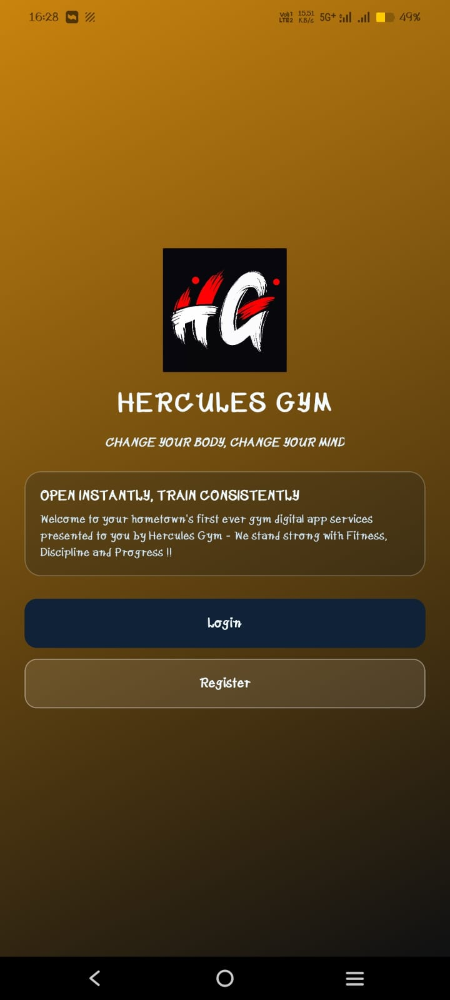
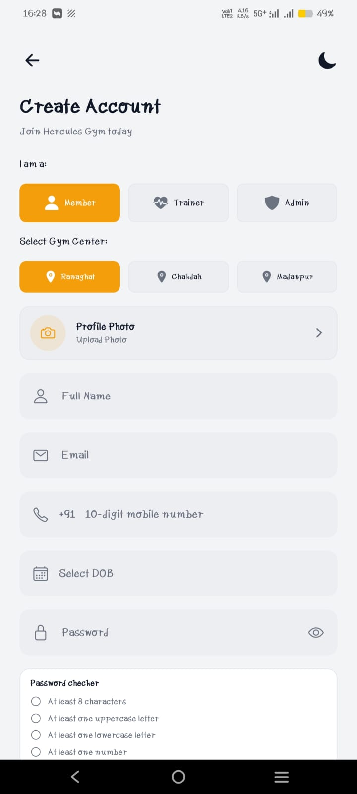
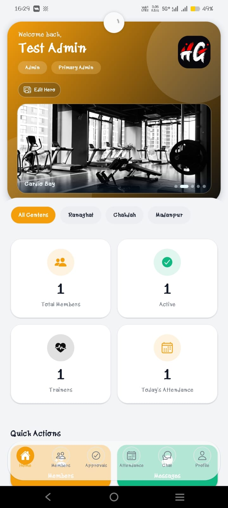
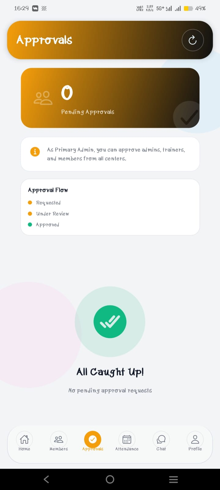
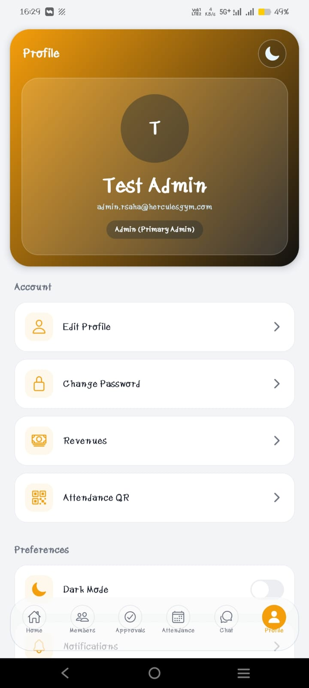
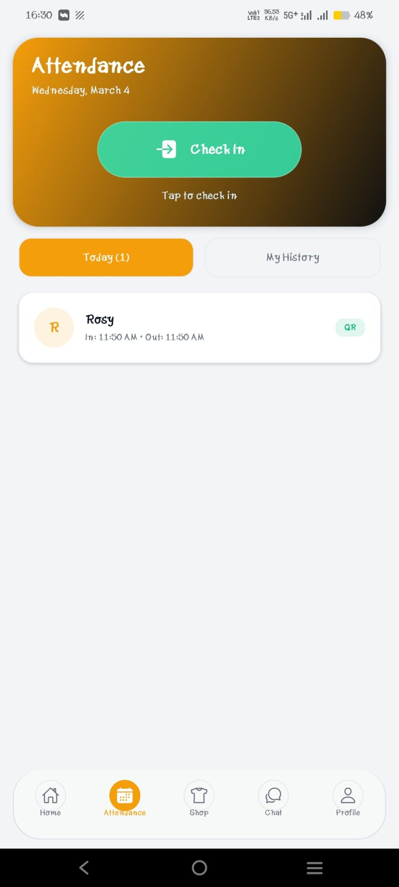
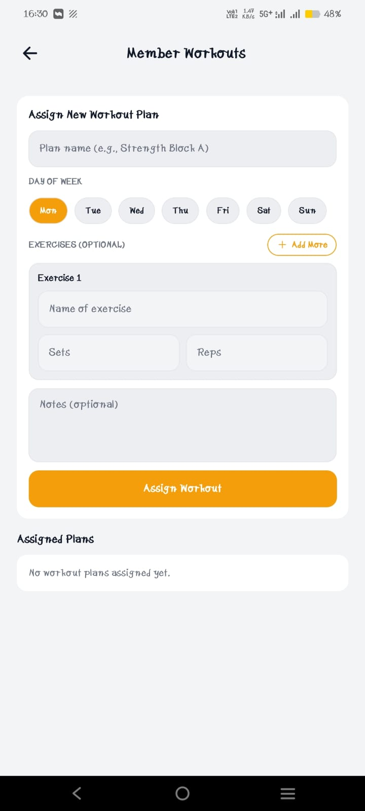
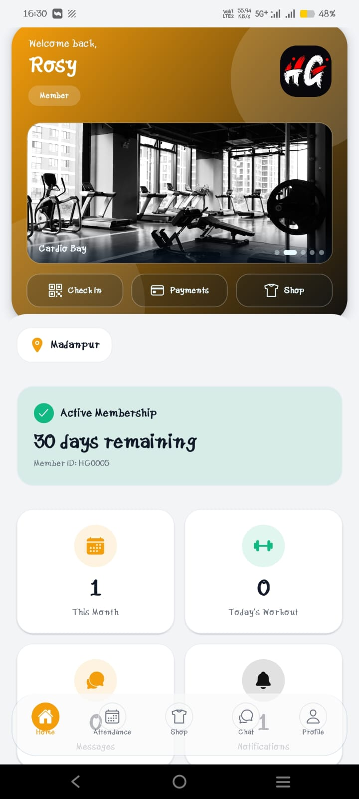
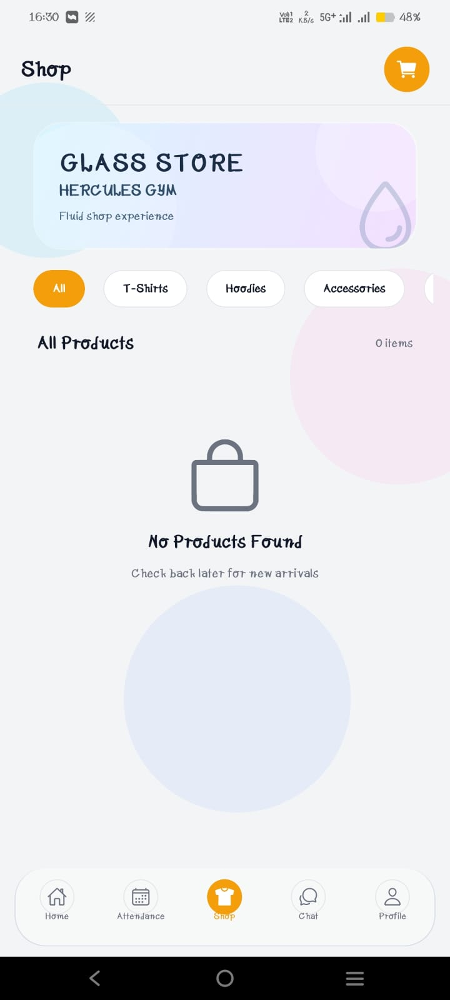

<div align="center">

  

  # 🏋️‍♂️ HERCULES GYM APP & CLOUD ECOSYSTEM
  ### Next-Generation Digital Gym Management Platform (Mobile & Web)

  [](https://fastapi.tiangolo.com/)
  [](https://react.dev/)
  [](https://expo.dev/)
  [](https://www.typescriptlang.org/)
  [](https://vitejs.dev/)
  [](https://tailwindcss.com/)
  [](https://www.mongodb.com/)
  [](https://redis.io/)
  [](https://cloud.google.com/run)
  [](https://workers.cloudflare.com/)
  [](https://cloudinary.com/)

  <p align="center">
    <strong>A client-driven, enterprise-grade digital gym operations ecosystem built for Hercules Gym to replace fragmented manual processes with a centralized, multi-branch, role-aware system.</strong>
  </p>

  <p align="center">
    <a href="https://herculesgym.rounaks-student.workers.dev">🌐 <strong>Live Web App</strong></a> •
    <a href="https://hercules-gym-api-847366288287.asia-southeast1.run.app/docs">⚡ <strong>API Documentation</strong></a> •
    <a href="#-mobile-app-screenshots">📱 <strong>Screenshots</strong></a> •
    <a href="#-system-architecture">🏗️ <strong>Architecture</strong></a>
  </p>
</div>

---

## 📌 Table of Contents
- [Why This Was Built](#-why-this-was-built)
- [Stakeholder Demands & Client Requirements](#-stakeholder-demands-client-requirements)
- [Production Deployments](#-production-deployments)
- [System Architecture](#-system-architecture)
- [Core Salient Features](#-core-salient-features)
- [High-Performance & Zero-Egress Optimizations](#-high-performance--zero-egress-optimizations)
- [Redis Caching & Automated Disaster Recovery](#-redis-caching--automated-disaster-recovery)
- [Design Architecture and UX Tactics Used](#-design-architecture-and-ux-tactics-used)
- [Client Impact & Operational Value](#-client-impact--operational-value)
- [Mobile & Web Screenshots](#-mobile--web-screenshots)
- [Complete Technology Stack](#-complete-technology-stack)
- [Repository Structure](#-repository-structure)
- [Local Development & Setup](#-local-development--setup)
- [Testing & Quality Assurance](#-testing--quality-assurance)
- [Deployment & Release Notes](#-deployment--release-notes)
- [Ownership & Attribution Context](#-ownership--attribution-context)

---

## 💡 Why This Was Built

**Hercules Gym** needed a unified digital ecosystem to eliminate paper registers and replace manual records across multiple physical branch locations:

- **Member Lifecycle & Approvals**: End-to-end registration, document approval, KYC, and emergency contacts.
- **Attendance & Check-in Consistency**: Real-time QR attendance with synchronized check-in / check-out logic and geo-location branch locks.
- **Workouts, Diet Plans & Trainer Assignments**: Structured routine builder and trainer-to-member allocation.
- **Membership & Shop Payment Records**: UPI UTR verification, instant payment receipts, and automated billing cycles.
- **Branch-Wise Communication & Announcements**: Real-time broadcasts, member feeds, and bilingual notices (English & Bengali).
- **Profile Data, Reminders & Operational Reporting**: Automated birthday greetings, fee expiration alerts, and comprehensive financial reports.

> **Primary Objective**: Centralized real-time records, rapid administrative decisions, zero manual bookkeeping errors, and complete fiscal accountability.

---

## 🎯 Stakeholder Demands (Client Requirements)

Built directly to client specifications:

* 📱 **Mobile-First Experience**: High-performance Native Android & iOS app for Admins, Trainers, and Members.
* 💻 **Web Management Portal**: Cross-platform Web application for desktop front-desk administration and member self-service.
* 🏢 **Multi-Branch Governance**: Granular branch segregation (**Ranaghat**, **Chakdah**, **Madanpur**) preventing cross-branch data leakage.
* 🗄️ **Centralized Cloud Database**: Highly available, clustered storage for all operational and historical data.
* 🛡️ **Zero-Loss Disaster Recovery**: Continuous automated backup snapshots and passive replica copies to ensure zero data loss.
* ⚡ **High-Throughput Redis Caching**: In-memory caching layer shielding primary databases from heavy spikes and malicious scraper traffic.
* 💳 **Payment Workflows**: Monthly payment reminders, proof upload (screenshots/receipts), and admin approval flows with late-fee calculations.
* ⏱️ **Role-Restricted Attendance**: Instant QR scan check-in/check-out with secure historical logs.
* 🌐 **Bilingual Support**: Native English and Bengali script support across all interfaces.
* 🚀 **Zero Downtime & Zero Cloud Cost**: Optimized for modern serverless free tiers (Google Cloud Run + Cloudflare + Cloudinary + MongoDB Atlas + Redis).
* 📦 **Production Play Store Pipeline**: EAS Android App Bundle (`.aab`) and APK distribution ready.

---

## 🌐 Production Deployments

| Component | Platform | URL / Endpoint |
| :--- | :--- | :--- |
| **Web Frontend** | Cloudflare Edge Workers | [`https://herculesgym.rounaks-student.workers.dev`](https://herculesgym.rounaks-student.workers.dev) |
| **Backend API** | Google Cloud Run (Asia-SE1) | [`https://hercules-gym-api-847366288287.asia-southeast1.run.app`](https://hercules-gym-api-847366288287.asia-southeast1.run.app) |
| **Swagger Docs** | Interactive OpenAPI UI | [`https://hercules-gym-api-847366288287.asia-southeast1.run.app/docs`](https://hercules-gym-api-847366288287.asia-southeast1.run.app/docs) |
| **Media Assets** | Cloudinary Global CDN | Edge-optimized AVIF/WebP image streaming |
| **Database** | MongoDB Atlas Cluster | Encrypted multi-tenant document storage |
| **Cache & Mirror** | Redis & In-Memory TTL Engine | Read-through caching with automated 12h DR snapshots |

---

## 🏗️ System Architecture

```text
               ┌────────────────────────────────────────────────────────┐
               │                     CLIENT LAYERS                      │
               └────────────────────────────────────────────────────────┘
                      │                                        │
           ┌──────────────────────┐               ┌──────────────────────────┐
           │   Android Mobile App │               │   React / Vite Web App   │
           │  (Expo React Native) │               │   (Cloudflare Edge CDN)  │
           └──────────────────────┘               └──────────────────────────┘
                      │                                        │
                      └──────────────────┬─────────────────────┘
                                         ▼
                 ┌──────────────────────────────────────────────┐
                 │       Google Cloud Run (Asia-SE1)            │
                 │        FastAPI Microservices Core            │
                 ├──────────────────────────────────────────────┤
                 │ • GZip Dynamic Compression (<400B threshold) │
                 │ • Multi-Tier Redis Cache Engine (Read-Thru)  │
                 │ • Automated Disaster Recovery Snapshotter    │
                 │ • JWT RBAC Auth & Branch Route Scopes        │
                 │ • Asynchronous Event Scheduler & Reminders   │
                 └───────────────────────┬──────────────────────┘
                                         │
        ┌────────────────────────────────┼────────────────────────────────┐
        ▼                                ▼                                ▼
┌───────────────┐               ┌─────────────────┐               ┌───────────────┐
│ MongoDB Atlas │               │ Cloudinary CDN  │               │ Redis / Cache │
│ Primary Store │               │ Media & Photos  │               │ In-Memory TTL │
└───────┬───────┘               └─────────────────┘               └───────────────┘
        │
        ▼ (Automated 12-Hour Sync)
┌────────────────────────────────┐
│  Disaster Recovery Snapshot    │
│  db.database_backups (Archive) │
└────────────────────────────────┘
```

---

## ⚡ Core Salient Features

### 1. Role-Based Access Control (RBAC) & Approvals
- **Four Distinct Roles**: `Primary Admin`, `Branch Admin`, `Trainer`, and `Member`.
- Automated approval workflow with photo verification, branch assignment, and onboarding status markers.

### 2. Multi-Branch Operations
- Centralized oversight with physical branch-level isolation for **Ranaghat**, **Chakdah**, and **Madanpur**.
- Branch-scoped trainers, member assignments, and accounting books.

### 3. QR-Based Attendance Engine
- Dynamic QR code check-in and check-out with time-window validation.
- Attendance history with date-range filters, monthly aggregation, and exportable logs.

### 4. Payments, Shop & Revenue Intelligence
- **Membership Subscriptions**: Monthly tracking, cycle renewals, grace periods, and late fee automation.
- **Gym Store Module**: Full supplement catalog with flavour and size variant selectors, inventory counters, and branch pickup verification.
- **Gym Store Module**: Inventory catalog, item purchases, and supplement order tracking.
- **Proof-of-Payment Verification**: Screenshot and UTR upload with admin one-click approval/rejection.
- **Financial Analytics**: Total collections, overdue payments, and monthly revenue visualizers.

### 5. Training & Nutrition Management
- Personalized workout creation with sets, reps, weight metrics, and rest timers.
- Customized dietary regimen builder with macro-nutrient guidance.

### 6. Communication & Engagement
- **Branch-Targeted Announcements**: Push and in-app broadcasts.
- **Automated Birthday Engine**: Automatic greetings to members and trainers.
- **Gym Wall & Hero Carousel**: Admin-curated photo gallery and achievement showcases.
- **Bilingual Interface**: Full English and native Bengali (বাংলা) support.

---

## 🚀 High-Performance & Zero-Egress Optimizations

To deliver maximum performance and operate smoothly within free-tier limits:

| Optimization Technique | Implementation Detail | Bandwidth / CPU Impact |
| :--- | :--- | :--- |
| **Read-Through Redis Caching** | `RedisCacheEngine` with TTL and pattern invalidation for hot endpoints | **80% – 90% DB query offload** on read-heavy traffic |
| **Dynamic GZip Compression** | `GZipMiddleware` applied to all API responses $\ge 400\text{ bytes}$ | **75% – 85% reduction** in raw JSON payload size |
| **CDN Media Offloading** | Base64 strings converted on upload and offloaded to Cloudinary CDN | **99.98% payload reduction** per image (~60B URL vs ~500KB Base64) |
| **Cloudflare Global Edge** | Static Vite web assets served from 330+ edge locations | **0 MB web egress** on Google Cloud Run |
| **Database Projection Indexing** | Optimized MongoDB compound indexes on `user_id`, `center`, `date` | **Sub-50ms query latency** under heavy load |
---

## 🛡️ Redis Caching & Automated Disaster Recovery

### 1. Multi-Tier Caching Architecture (`RedisCacheEngine`)
To prevent database CPU spikes from high-frequency reads or malicious scraper loops:
* **Read-Through Caching**:
  * **Merchandise & Supplements (`/api/merchandise`)**: Cached with 120s TTL for instant catalog browsing.
  * **Announcements & Alerts (`/api/announcements`)**: Scoped per role and center with 60s TTL.
  * **Master Product Catalog (`/api/catalog`)**: Cached for 300s.
  * **Admin Dashboard Metrics (`/api/dashboard/admin`)**: Cached for 30s.
* **Instant Invalidation on Mutation**: When an administrator adds, updates, or deletes items or announcements, the cache engine immediately purges matching key patterns (`cache:merchandise*`, `cache:announcements*`).
* **Resilient In-Memory Fallback**: If Redis network disconnects, the engine seamlessly falls back to an internal in-process TTL cache with zero downtime or user impact.

### 2. Automated Disaster Recovery & Database Mirroring (`DisasterRecoveryEngine`)
To guarantee business continuity even if the primary database is lost or corrupted:
* **Automated 12-Hour Snapshots**: A background worker continuously exports point-in-time replicas of all core collections (`users`, `member_profiles`, `payments`, `attendance`, `announcements`, `merchandise`, `merchandise_orders`, `chats`, `workout_logs`, `diet_plans`) to a rolling archive (`db.database_backups`).
* **One-Click Point-in-Time Restore**: Admins can restore entire databases or individual collections directly through the API.
* **Disaster Recovery & Backup API Endpoints (Admin-Only)**:
  * `GET /api/admin/backups` — List all backup snapshots with sizes, doc counts, and timestamps.
  * `POST /api/admin/backups/create` — Generate an on-demand snapshot prior to updates or migrations.
  * `POST /api/admin/backups/restore/{backup_id}` — Restore all or selected collections from any snapshot.
  * `GET /api/admin/backups/export/{backup_id}` — Export and download the complete JSON archive for offsite cold storage (Google Drive / AWS S3).

---

## 🎨 Design Architecture and UX Tactics Used

- **Role-Oriented Information Architecture**: Separate, tailored navigation models for members, trainers, and administrators.
- **Branch-Aware Domain Modeling**: Strict validation ensuring data operations remain scoped to the selected gym branch.
- **API-First Backend Design**: Pydantic schemas enforce type safety and seamless cross-platform consistency.
- **Operational Resilience**: Retry wrappers for database queries and graceful degradation on transient connections.
- **Dynamic Visual Language**: Modern cards, responsive data grids, accessible color contrast, and fluid animations.

---

## 📈 Client Impact & Operational Value

- **Zero Paper Reliance**: 100% digital transition for member files, receipts, and attendance registers.
- **90% Faster Onboarding**: Rapid member registration with instant QR credential generation.
- **Complete Financial Transparency**: Immutable payment audit logs with receipt proofs and revenue metrics.
- **Unified Communication**: Instant broadcast capability across all branch members in English & Bengali.

---

## 📱 Mobile & Web Screenshots

<div align="center">
  <h3>📱 Android Mobile App Interface</h3>
</div>

| Onboarding & Landing | Account Registration | Admin Command Center |
| :---: | :---: | :---: |
|  |  |  |

| Member Approvals | Admin Profile & Security | QR Attendance Tracker |
| :---: | :---: | :---: |
|  |  |  |

| Workout & Diet Plans | Member Portal Home | Gym Supplement Store |
| :---: | :---: | :---: |
|  |  |  |

---

## 🛠️ Complete Technology Stack

### Web Frontend & Admin Portal
- **Framework**: React 18 with TypeScript
- **Bundler & Build**: Vite 6
- **Styling**: Tailwind CSS + Lucide Icons
- **Animation**: Motion (Framer Motion)
- **Deployment**: Cloudflare Workers / Pages Static Assets

### Mobile Application
- **Runtime**: Expo / React Native
- **Navigation**: Expo Router
- **State Management**: Zustand + React Query
- **Distribution**: EAS Build (APK & AAB)

### Backend & Cloud Services
- **API Framework**: FastAPI (Python 3.11)
- **Primary Database**: MongoDB Atlas via Motor (AsyncIO driver)
- **Caching & Rate Limiting**: Redis & In-Memory TTL Fallback
- **Disaster Recovery**: Automated 12h point-in-time snapshot archiving
- **Image Optimization & CDN**: Cloudinary Media API
- **Real-Time Communication**: Socket.IO
- **Hosting**: Google Cloud Run (Containerized Docker microservice)

---

## 📂 Repository Structure

```text
Hercules-Gym-App/
├── backend/                  # FastAPI Microservices Backend
│   ├── server.py             # Primary API server, RBAC, Caching & Disaster Recovery
│   └── requirements.txt      # Python dependencies
├── src/                      # React 18 + Vite Web Application
│   ├── components/           # UI components, modals & dialogs
│   ├── services/             # Axios API client & backend bindings
│   ├── worker.ts             # Cloudflare Worker Edge Asset handler
│   └── App.tsx               # Main web application entrypoint
├── frontend/                 # Expo / React Native Mobile Application
│   ├── app/                  # Mobile screens & navigation routes
│   ├── app.json              # Expo configuration
│   └── eas.json              # Expo Application Services build profiles
├── docs/
│   └── screenshots/          # Production app screenshots
├── public/                   # Static branding logos and icons
├── Dockerfile                # Backend Cloud Run container specification
├── Dockerfile.web            # Web container configuration
├── cloudbuild.yaml           # Google Cloud Build CI/CD pipeline
├── wrangler.jsonc            # Cloudflare Workers deployment configuration
└── README.md                 # Project documentation
```

---

## 💻 Local Development & Setup

### 1. Prerequisites
- **Node.js**: v18.0 or higher
- **Python**: v3.10 or v3.11
- **MongoDB**: Local instance or MongoDB Atlas connection URI

### 2. Backend Setup
```bash
cd backend
python -m venv .venv

# On Windows:
.venv\Scripts\activate
# On Linux/macOS:
source .venv/bin/activate

pip install -r requirements.txt
uvicorn server:app --reload --host 0.0.0.0 --port 8000
```

### 3. Web Frontend Setup
```bash
# In the root directory:
npm install
npm run dev
```
Open `http://localhost:3000` in your browser.

### 4. Mobile App Setup (Expo)
```bash
cd frontend
npm install
npm run start
```
Scan the displayed QR code with the **Expo Go** app on Android or iOS.

---

## 🧪 Testing & Quality Assurance

- **Type Safety**: Verified via `npx tsc --noEmit`.
- **Linter & Syntax Checks**: Executed via project build pipeline.
- **Backend Validation**: Python byte-compilation check (`python -m py_compile backend/server.py`).
- **End-to-End Workflows**: Multi-branch authentication, QR scanning, payment uploads, and admin approval tests.

---

## 🚢 Deployment & Release Notes

- **Cloudflare Edge Web App**: Auto-deploys from GitHub `main` branch via `wrangler`.
- **Google Cloud Run Backend**: Auto-built and deployed with Google Cloud Build triggers.
- **Android Mobile App**: Packaged into `.apk` and `.aab` artifacts using EAS Build for Google Play Console submission.

---

## 🏛️ Ownership & Attribution Context

This platform is a proprietary custom solution developed in direct collaboration with the **Hercules Gym Owner & Stakeholders** to serve as their permanent, centralized digital gym operations infrastructure.

<div align="center">
  <sub>Built with ❤️ for Hercules Gym • Ranaghat • Chakdah • Madanpur</sub>
</div>
